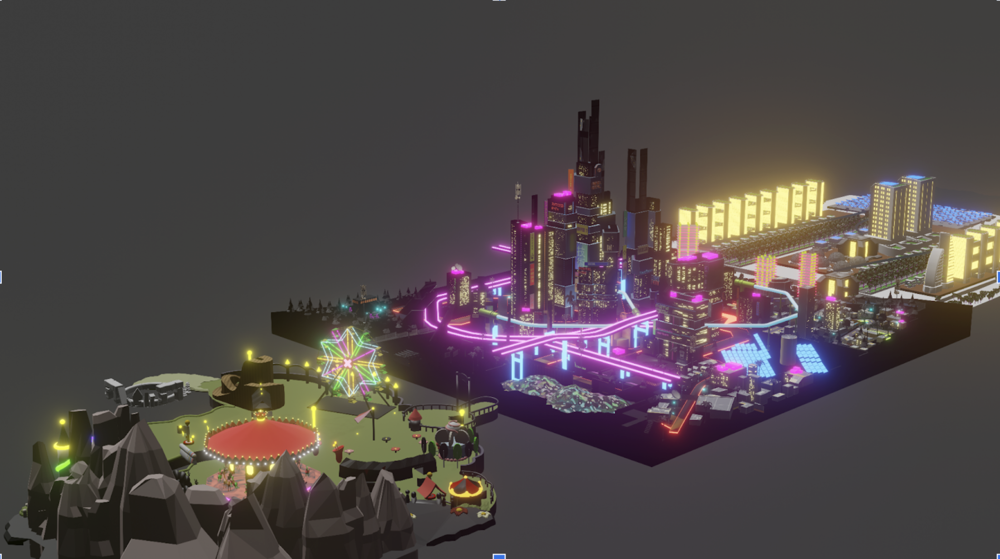

# MetaCRAM

> Welcome to metaCRAM, an immersive metaverse that offers a guided storyline where individuals can build their own adventure and embark on an epic journey to complete the map and find its treasure.

In metaCRAM, you'll explore a vast and breathtaking virtual world, filled with challenges and mysteries waiting to be discovered. Whether you're a seasoned adventurer or a curious newcomer, there's something for everyone in this metaverse.

The project is still in progress, and we're constantly working to enhance the experience for our users. We plan to launch the first iteration of metaCRAM by the end of this year, and we can't wait to share it with the world.

In the meantime, here are some images from an earlier version of the project to give you a glimpse of what's to come:

As you can see, metaCRAM is a visually stunning metaverse with a rich and detailed environment. But it's not just about the graphics - we've also put a lot of thought into the storyline and gameplay mechanics.

With metaCRAM, you'll have the freedom to choose your own path and make decisions that affect the outcome of your journey. Whether you decide to explore every nook and cranny of the world or race to the finish line, the choice is yours.

> We hope that you're as excited about metaCRAM as we are. Stay tuned for more updates, and get ready to embark on an unforgettable adventure!

Old repo can be found at https://github.com/Legend101Zz/vr-project-meta-plex

